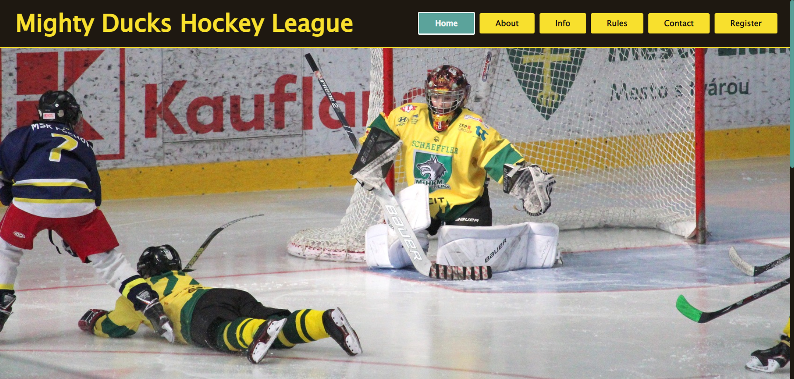
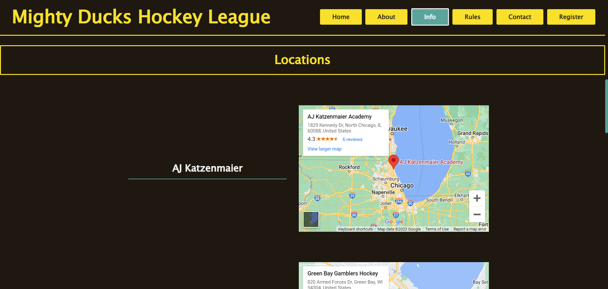
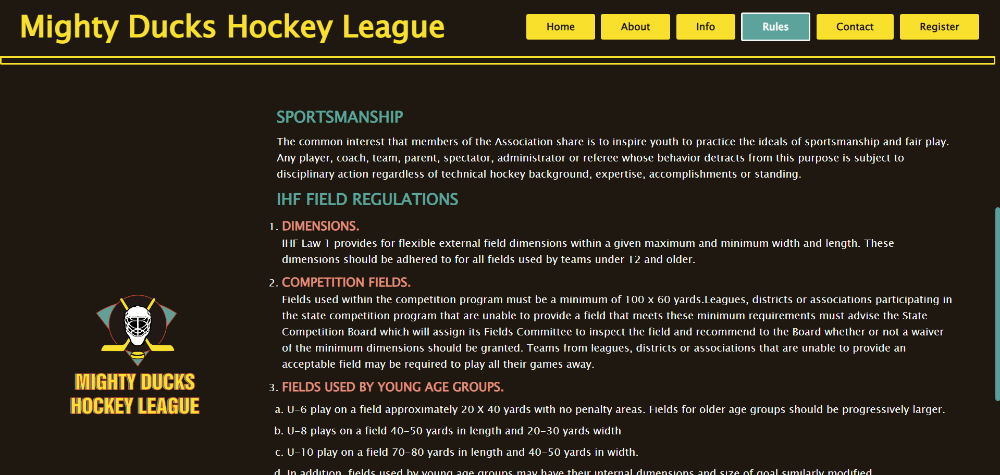
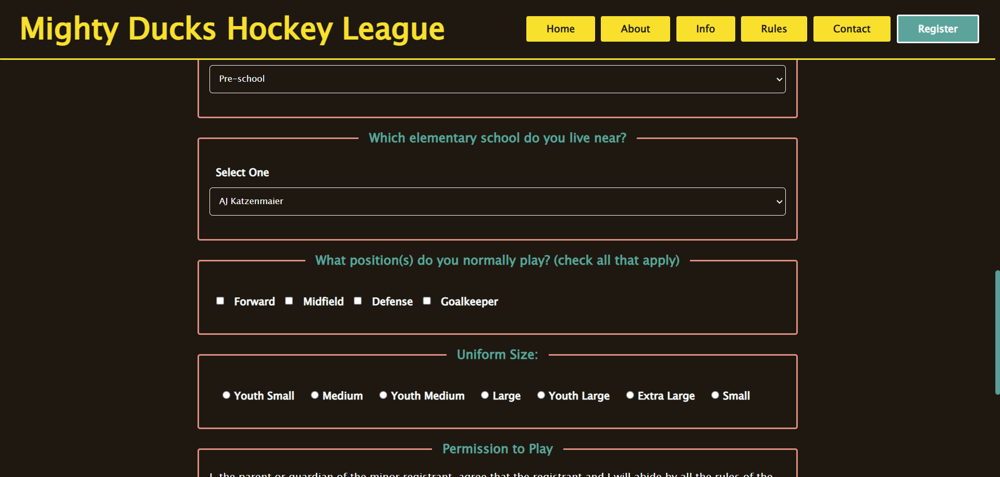

# 🦆 Mighty Ducks Hockey League Page 🏑
This is a web development project for the MindHub bootcamp.
It consists of a website for the Mighty Ducks field hockey league,
which has 6 HTML pages: index, contact, about, info, registration and rules.
The page uses only HTML and pure CSS for its design and functionality.

## Installation

Download the zip file of the project, unzip it and open index.html

or 

Clone the GitHub repository on your local computer with:

    git clone https://github.com/tu_usuario/mighty-ducks.git

then open index.html
 
## Screenshots

## License

This project is licensed under the MIT License - see the LICENSE.md for more details.
