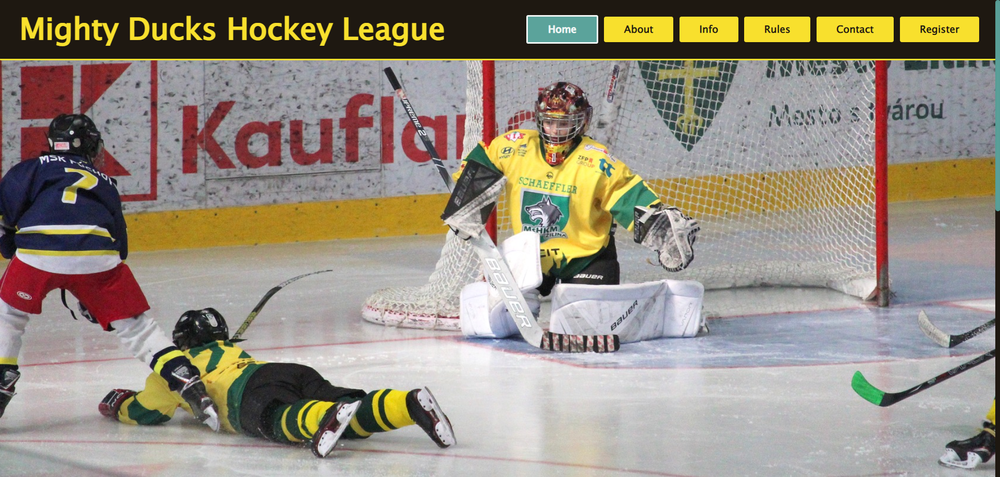
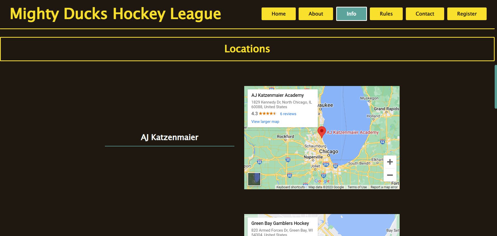
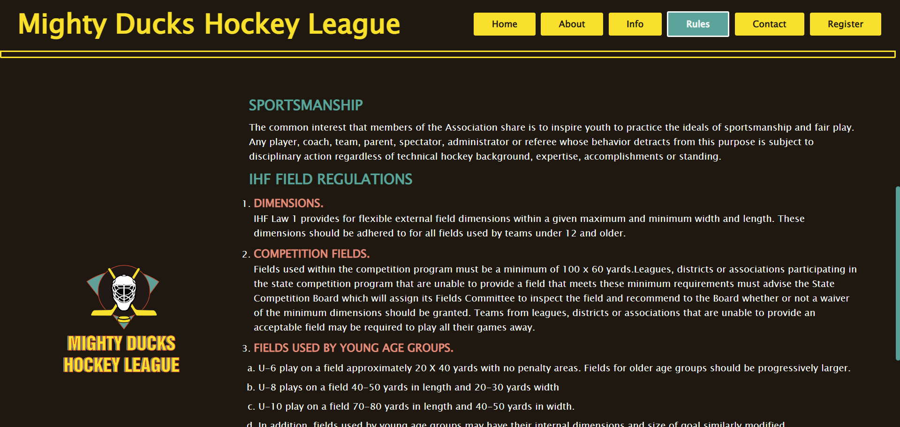
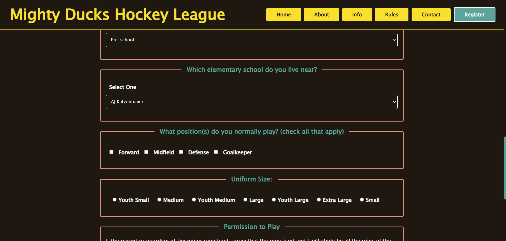

🦆 Mighty Ducks Hockey League Page 🏑
This was my first project in the MindHub bootcamp, serving as an introduction to web development. It was built using only HTML and pure CSS, without JavaScript or frameworks.

The website consists of six pages: index, contact, about, info, registration, and rules, all designed with a simple yet functional layout.

⚠️ Status: No further updates or improvements will be made. The project is now archived for reference.

## Installation

Download the zip file of the project, unzip it and open index.html

## Screenshots

***

***

***

## License

This project is licensed under the MIT License - see the LICENSE.md for more details.
